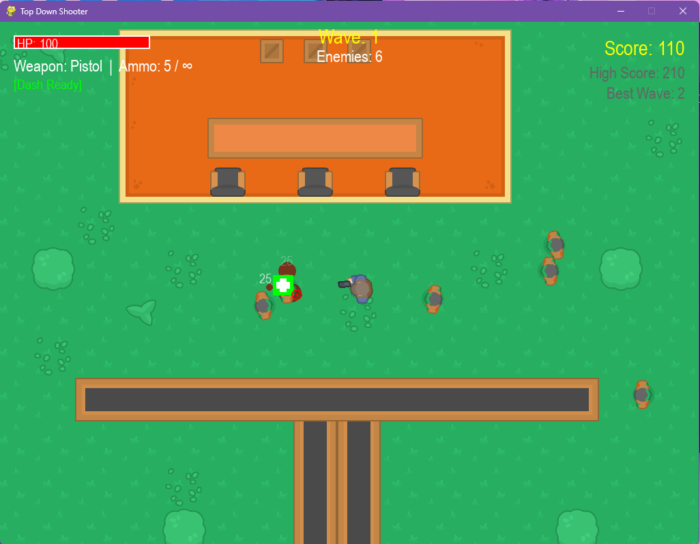

# Pro Top-Down Shooter (Python/Pygame)



A fully featured, highly modular Top-Down Shooter built with Python and Pygame. This project was recently refactored from a simple prototype into a professional-grade portfolio piece, demonstrating advanced software engineering principles, game architecture, and performance optimization.

## 🚀 Features

*   **Robust Game Architecture:** Fully modular design separating Core Engine, Entities, Systems (Collision, Pathfinding, Audio), and UI into distinct packages.
*   **Finite State Machine (FSM) AI:** Enemies utilize an FSM (Idle, Chase, Attack) coupled with Flow Field Pathfinding and Boids separation algorithms for intelligent swarming behavior.
*   **Extensible Weapon System:** Abstract Weapon class with derived types (Pistol, Shotgun, SMG, Assault Rifle, Sniper Rifle) supporting variable fire rates, spread, and damage. Object-pooled and asset-cached bullets for high performance.
*   **Dynamic Wave Manager:** Progressive difficulty scaling with dynamic, off-screen enemy spawning just outside the camera viewport boundaries.
*   **Performance Optimization:** Centralized Asset Manager caches all images, sounds, fonts, and spritesheets, completely eliminating mid-loop I/O bottlenecks. Boids separation optimization uses squared-distance checks to skip square roots. Fixed timestep/Delta Time movement for 60+ FPS stability.
*   **Polished UI/UX & Juiciness:** Health bars, reload sprites, wave tracking, screen shake, blood splatters that fade out over time, milestone achievements, particle systems, and damage i-frames with visual flashing.
*   **Persistent Saving:** JSON-based save management for High Scores, Best Wave, Lifetime Kills, and Audio Settings.

## 📁 Architecture Overview

```text
src/
├── main.py                 # Application entry point
├── core/
│   ├── engine.py           # Main Game Loop and Orchestrator
│   ├── settings.py         # Global Constants and Configuration
│   ├── camera.py           # Smooth Lerp Camera System
│   └── assets.py           # Centralized Asset Caching (Singleton)
├── entities/
│   ├── player.py           # Player Controller (Movement, Health, I-Frames)
│   ├── zombie.py           # FSM-driven AI with Pathfinding & Boids
│   ├── bullet.py           # Bullet Physics and Object Pooling
│   ├── obstacle.py         # Static Collision Bodies
│   └── weapon.py           # Extensible Weapon Archetypes
├── systems/
│   ├── collision.py        # Abstract Collision Handlers
│   ├── pathfinding.py      # A* Pathfinding Implementation
│   ├── save_manager.py     # JSON Data Persistence
│   ├── wave_manager.py     # Difficulty and Spawn Scaling
│   ├── effects.py          # Screen Shake & Particle Emitters
│   └── audio.py            # Master/SFX/Music Volume Management
└── ui/
    ├── hud.py              # In-Game Heads Up Display
    └── menu.py             # Main Menu, Pause Screen, Game Over
```

## 🛠️ Installation & Setup

### 📦 Play Standalone (Windows)
A compiled, standalone executable is available for download on GitHub under the release tag [v1.0.0](https://github.com/yourusername/Top_Down_Shooter_Game/releases/tag/v1.0.0). No installation of Python or dependencies is required!

### 💻 Run from Source
1.  **Clone the repository:**
    ```bash
    git clone https://github.com/yourusername/Top_Down_Shooter_Game.git
    cd Top_Down_Shooter_Game
    ```
2.  **Install dependencies:**
    ```bash
    pip install -r requirements.txt
    ```
3.  **Run the game:**
    ```bash
    python src/main.py
    ```

## 🎮 Controls
*   **W, A, S, D:** Move
*   **Left Shift:** Sprint
*   **Mouse Cursor:** Aim
*   **Left Mouse Click:** Shoot (Hold for automatic weapons)
*   **Caps Lock / E:** Cycle Weapons
*   **C:** Reload
*   **Space:** Dash
*   **ESC:** Pause Game

## 💡 Engineering Highlights for Code Reviewers

This project adheres to **SOLID** principles where applicable in game development:
*   **Single Responsibility:** Collision, pathfinding, and drawing logic are decoupled from entity classes.
*   **Open/Closed:** The Weapon and System architectures allow new weapons or systems to be added without modifying core loops.
*   **Resource Management:** The `BulletPool` reduces garbage collection overhead by reusing bullet instances. The `AssetManager` ensures expensive I/O operations happen only once (including bullet texture loads).
*   **Resilience:** The Save and Audio managers feature robust `try/except` fallback mechanisms, preventing crashes if files are missing or hardware is unavailable.
*   **Swarm Algorithm Optimization:** Optimized the FSM swarm separation loop using `length_squared()` checks before calculating actual normal vectors, reducing computational overhead by bypassing square root calculations for all non-adjacent entities.
*   **Decal Memory Management:** Transient blood splatters are instantiated as low-layer sprites (`_layer = -1`) and fade out dynamically to prevent map texture clutter and memory bloat over long play sessions.

## 🔜 Future Roadmap
*   Boss fights with complex behavior trees.
*   Loot drops (Ammo, Health Packs, Weapon Upgrades).
*   Level transitions and procedural map generation.
